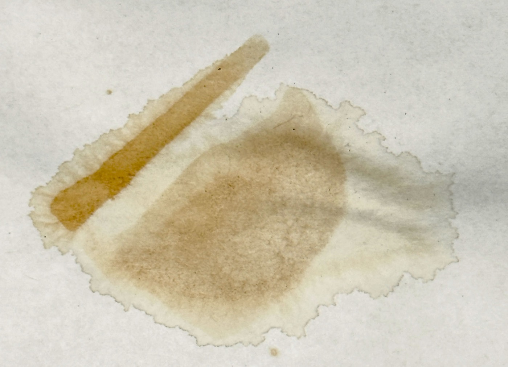
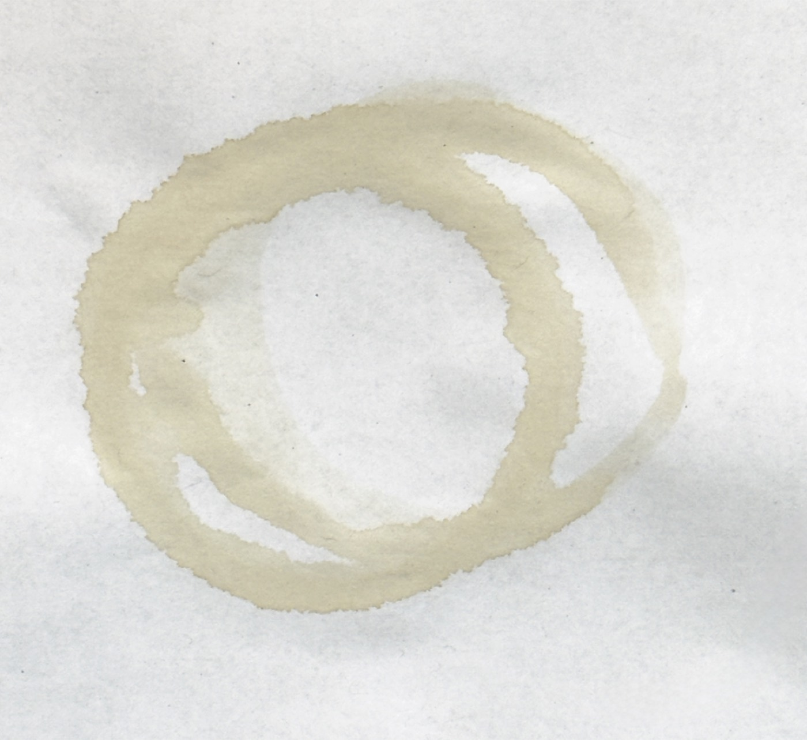
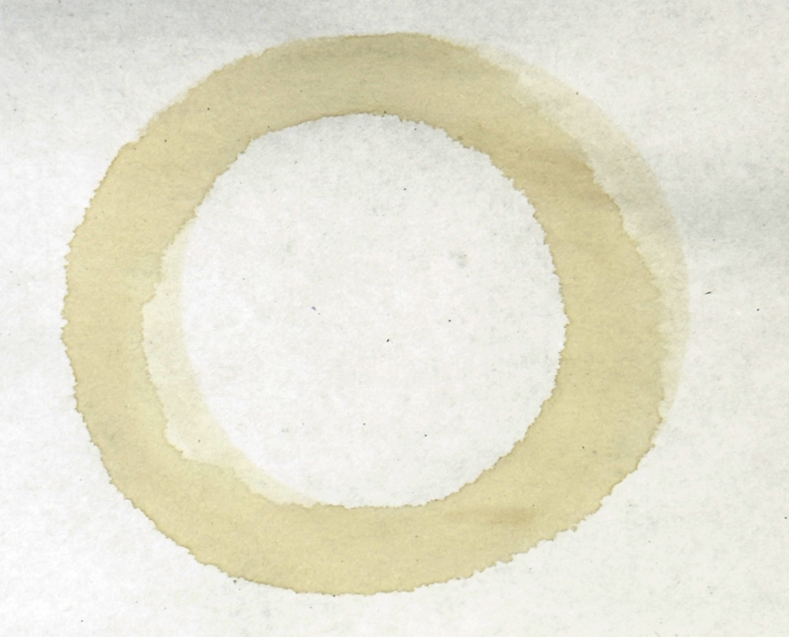
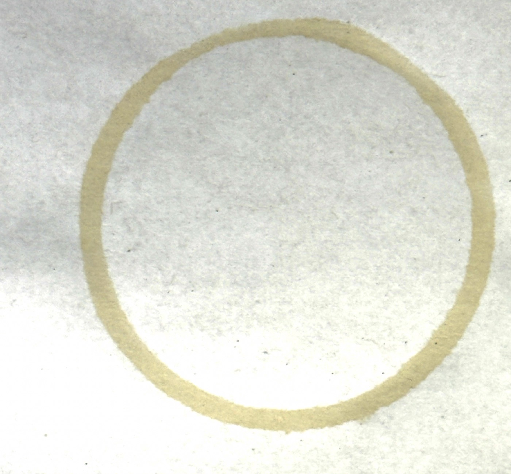
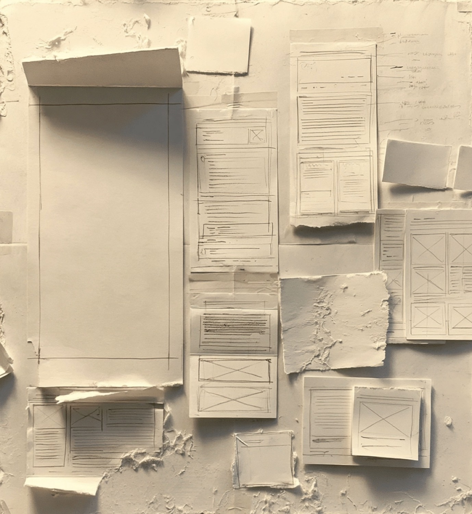
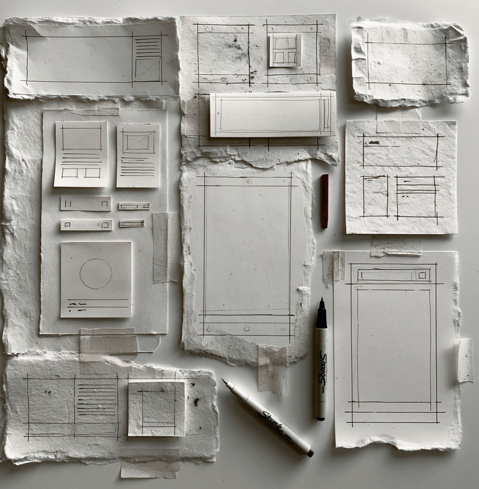
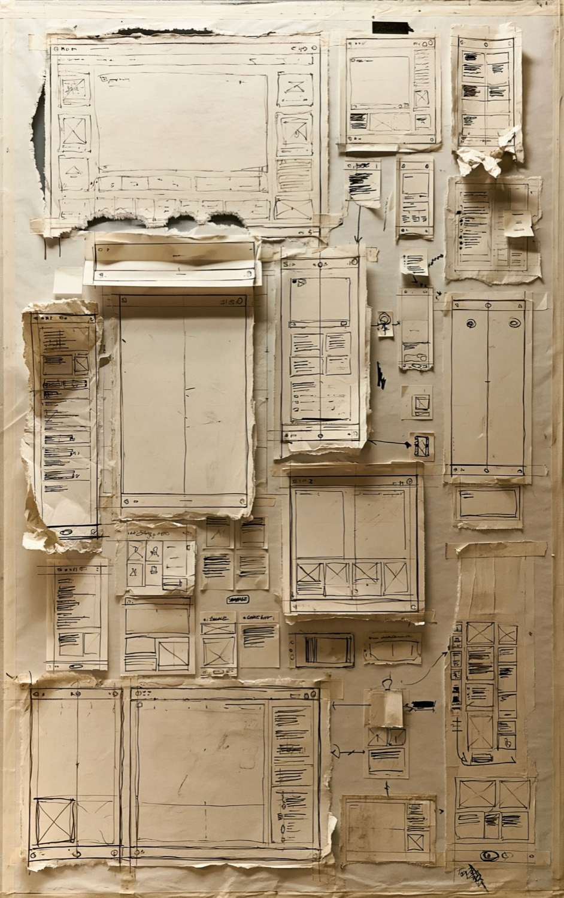
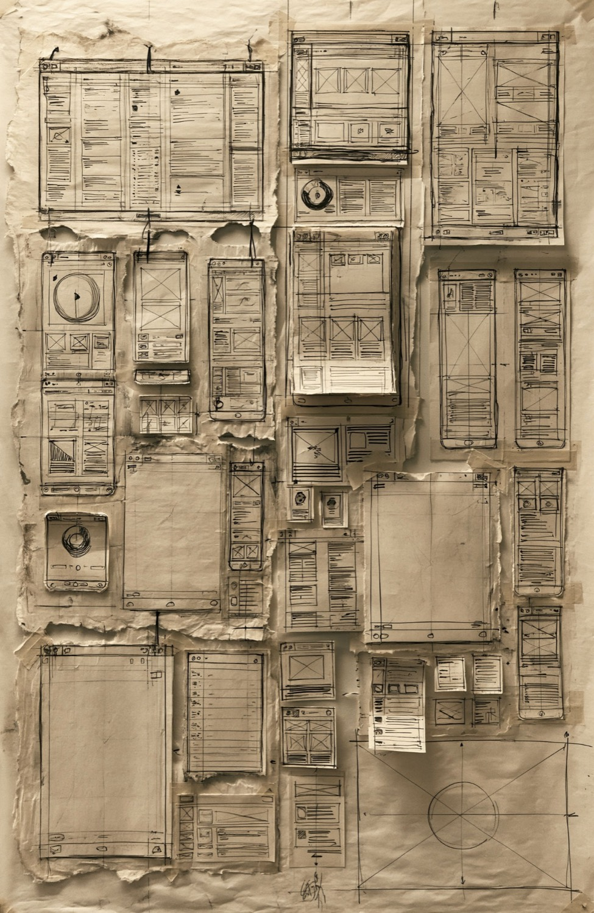
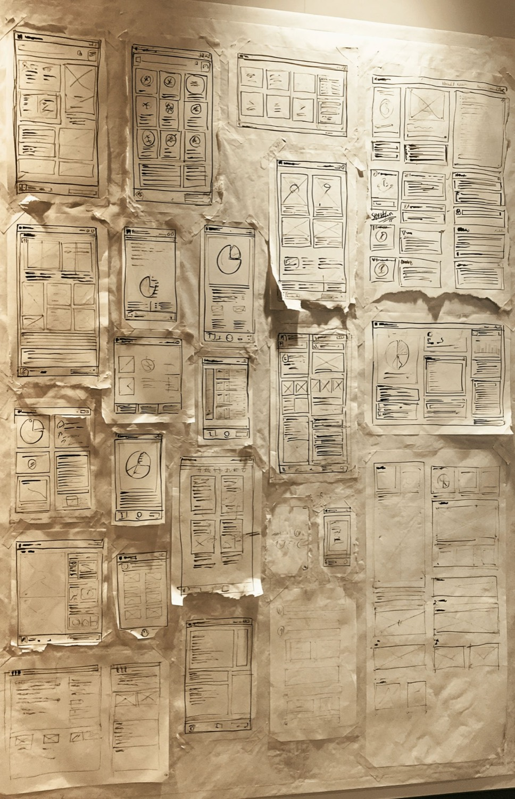

# Napkin References

The visual reference corpus behind the napkin-tier evolution (2026-06 round, eqPartners): real stains and paper-prototype boards that the generative systems were calibrated against. Companions: [[Pen-Samples]] for stroke calibration, [[Fidelity-Levels]] and [[Paper-Utilities]] for where these land in code.

## Stains (drive the coffee-ring + tea-stain generators)

| | |
| --- | --- |
|  | **Tea-bag stain** — 3 layers: seeping water w/ ragged tide line, fabric-mottled bag body, dark seam. Model for `buildTeaStainSVG`. |
|  | **Double set-down, broken arcs** — lifted-cup look; dash-gap + offset second pass in `buildCoffeeRingSVG`. |
|  | **Heavy annulus + ghost echo** — wide ragged band, faint offset echo, interior haze. |
|  | **Thin crisp band** — the minimal ring style. |

## Boards (drive the cut-out / tape / shadow / layering model)

| | |
| --- | --- |
|  | **Plaster board, pencil sketches** — pieces defined by tone + short flat-lay shadow, no ink at the cut edge. |
|  | **Handmade paper + Sharpies + tape** — fine inner frames with corner overshoot; masking-tape strips; deckled edges. |
|  | **Sepia taped board 1** — overlapping torn/cut pieces, ballpoint wireframe vocabulary (X-boxes, squiggle text). |
|  | **Sepia taped board 2** — denser variant of the same language. |
|  | **Sharpie wall (angled)** — title-bar rule under every sheet's header chrome → the measured header rule in the ink-frame generator. |

## Design decisions taken from this corpus

- Stains live **on the board, under the pieces** (z:-1) and scroll with the page.
- The paper edge carries **no ink** — tone + a short layered shadow define the cut; the drawn frame sits inside.
- Frames are **fine technical-pen strokes** with corner overshoot, pen-dependent pooling/skips/tails ([[Pen-Samples]]).
- ~30% of pieces get a **masking-tape strip**; some pages are clean, busy desks collect up to 5 stains; coffee is one pigment, tea has a leaf palette (black / faint ceylon / faint green) with one leaf per drinker.

---

**Working assumption, unvalidated (2026-06-12).** The roughness is doing psychological work, not just aesthetic work. The hypothesis: artifact fidelity sets the altitude of the critique — polished comps pull reviewers toward color/alignment/defect-hunting; rough artifacts pull them toward flow, structure, and "is this the right idea" (cf. Buxton, *Sketching User Experiences*; Wong 1992). The stains/pens/cuts go a step past generic lo-fi by adding *provenance* — the screen reads as someone's in-progress working artifact, which (a) grants permission to request structural change without the social cost of "wasting" polished work, and (b) signals co-authorship rather than sign-off. Supporting anecdote, not proof: a stakeholder reviewing the realistic Day-N alternates missed content placed above the search input — they were *using* the screen in their head, not auditing it. If napkin-mode review conversations measurably stay at direction level where polished-mode ones don't, this stops being an assumption.
