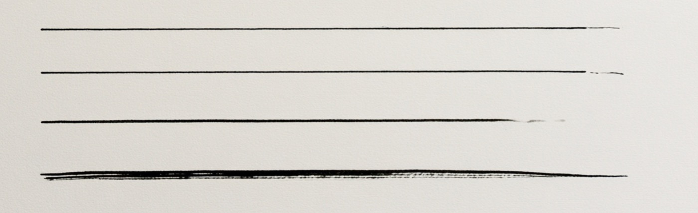
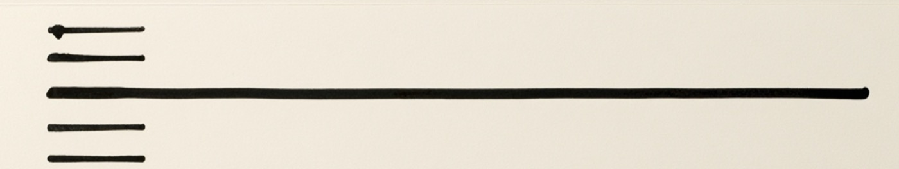
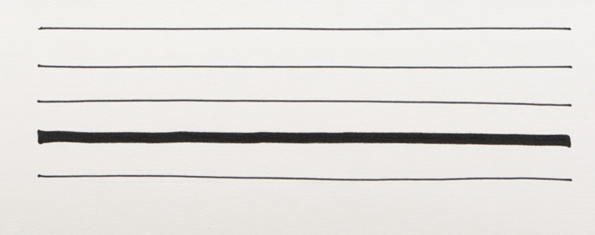
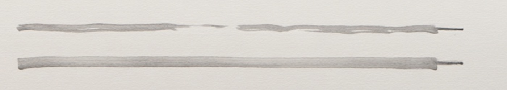
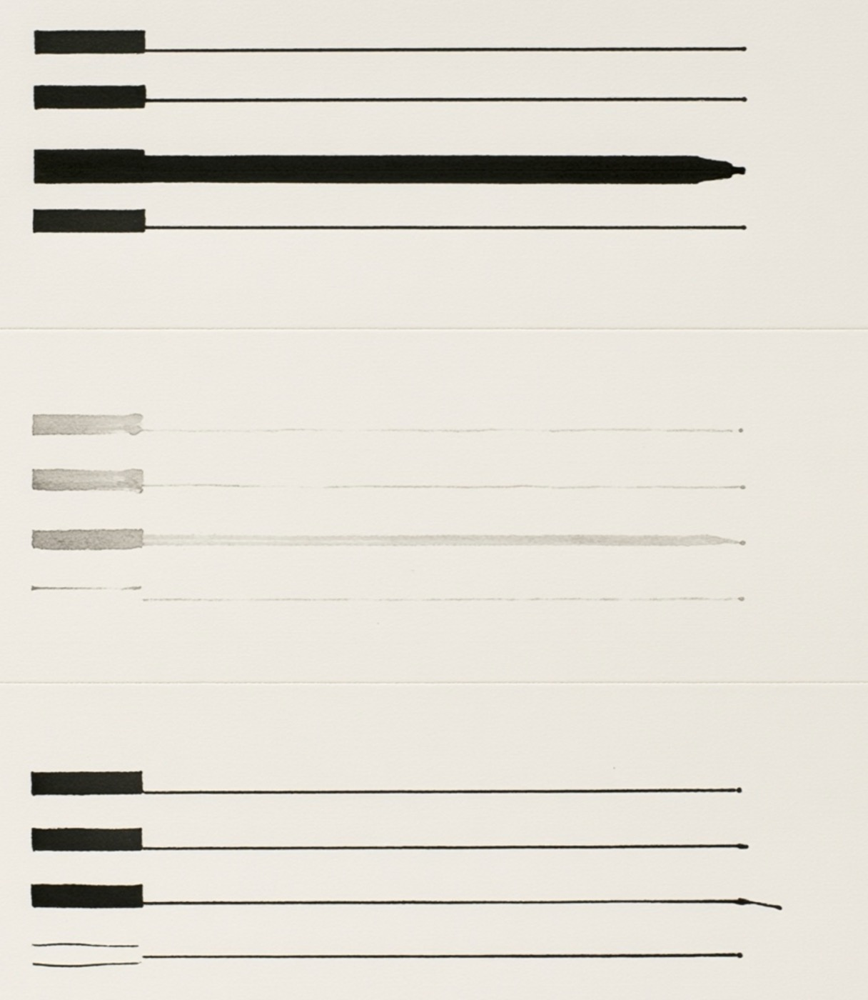
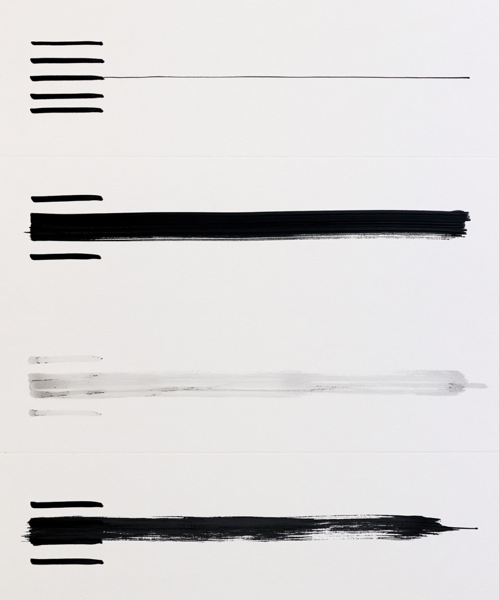
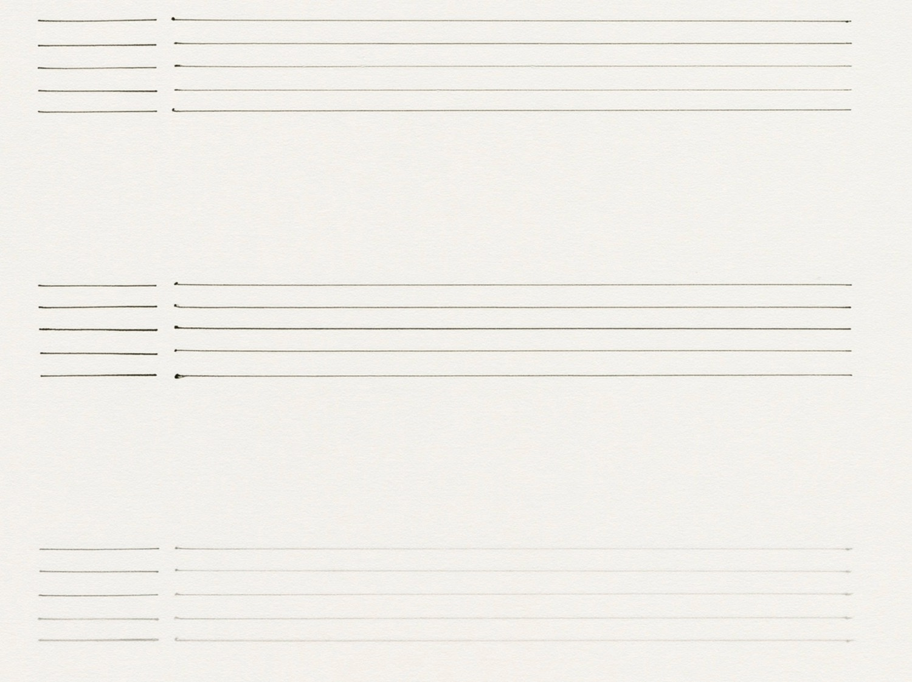
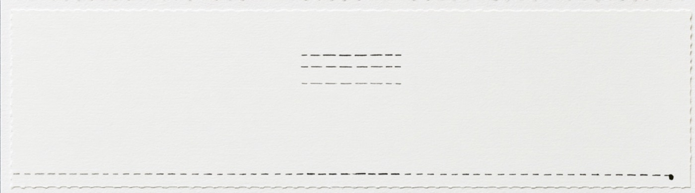
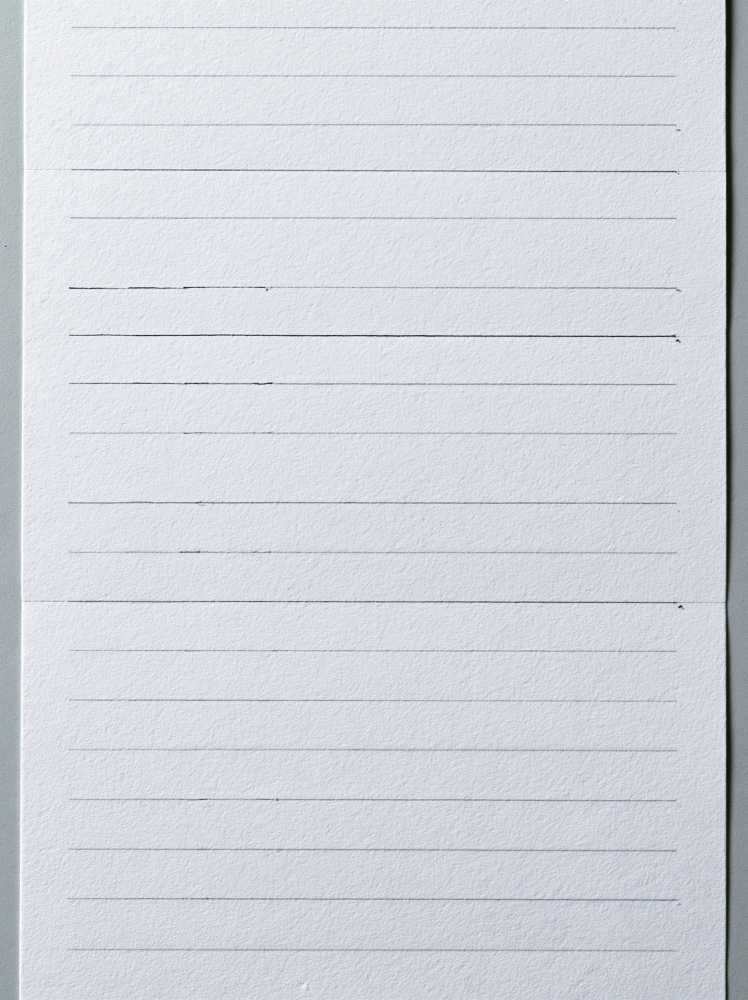

# Pen Samples

Reference stroke samples for calibrating the napkin-tier **ink-frame generator** (the hand-ruled technical-pen card outlines — see [[Fidelity-Levels]] and [[Paper-Utilities]]). Generated with Midjourney V8.1, 2026-06-12, from the pen-comparison recipes in the eqPartners wiki (`wiki/references/midjourney-cheatsheet.md`). Curated to the calibration-useful set and recompressed (~400KB total); the brush-weight outtakes were discarded as off-model.

The generator these calibrate currently lives in eqPartners `prototype/wf-nav.js` (`buildInkFrameSVG` + the `PENS` profile table: rotring / muji gel / ballpoint / fine sharpie, each with nib width, ink alpha, pool / skip / tail probabilities). **Pending back-port to nib** once the current evolution round settles.

## Samples

### Hairline with fade-out — `assets/pen-samples/hairline-fadeout.jpg`

Very fine uniform runs that disintegrate at the end of the stroke — the tail breaks into fragments rather than thinning smoothly. The bottom stroke shows multi-pass doubling (ballpoint retrace). **Takeaway:** the light-tail should sometimes render as broken fragments, not just a thinner segment.

### Pooled starts — `assets/pen-samples/pooled-starts.jpg`

Short strokes with a distinct round pool where the nib lands, tapering immediately. **Takeaway:** pool size relative to nib is bigger than first modeled (~1.5–2× nib width), and the stroke thins right out of the pool.

### Fine-liner wobble — `assets/pen-samples/fineliner-wobble.jpg`

Long thin lines with gentle low-frequency drift and tiny dots at the stroke ends; one heavy marker line for contrast. **Takeaway:** end-of-stroke dot (pen lift deposit) is a real, frequent artifact — worth adding alongside the start pool.

### Ballpoint grey with skips — `assets/pen-samples/ballpoint-grey-skips.jpg`

Light grey, broken contact, ragged partial coverage — the ballpoint personality. **Takeaway:** validates the low-alpha + high-skip profile; skips can be long (a third of the stroke), not just 2–5px nicks.

### Start blocks and end dots — `assets/pen-samples/start-blocks-end-dots.jpg`

Heavy rectangular ink blocks at stroke starts running into hairlines that terminate in tiny dots; a faint washed-out set in the middle (dying pen). **Takeaway:** the most exaggerated pooling form; the faint middle set is a good "dying pen" alpha reference (~0.15–0.25).

### Dry-brush start blocks — `assets/pen-samples/drybrush-start-blocks.jpg`

Heavy start blocks into hairlines; one dry-brush smear and one faint pass. **Takeaway:** the start "pool" can read as a short solid block, not just a dot — an occasional alternate pooling form.

### Thin pens, banded — `assets/pen-samples/thin-pens-banded.jpg`

The best thin-pen calibration sheet so far: hairline strokes with pooled start dots, tiny end dots, and a faint dying-pen bottom band. Composition too sparse (next prompt iteration tightens band spacing) but the stroke physics are exactly on model.

### Kiss-cut perforated sheet — `assets/pen-samples/kisscut-perforated-sheet.jpg`

Kiss-cut/perforation language: dashed cut lines on the sheet, deckled top edge. **Future variant idea:** a "kiss-cut" piece outline — perforation dashes at the very cut edge (distinct from the drawn inner ink frame), like a piece waiting to be peeled off the backing.

### Benchmark: fine-pen full page — `assets/pen-samples/benchmark-fine-pen-fullpage.jpg`

The target render (MJ V8.1, "graphic designer's practice sheet" framing): full-page hairlines on textured paper, pen-lift dots, skips, faint dying passes — the composition and physics the ink-frame generator should converge on. The prompt lives in the eqPartners MJ cheatsheet as the preferred v3 recipe.

## Ruled-sheet series (practice-sheet prompt, 2026-06-12)

Full-page outputs from the v3 "designer's practice sheet" recipe, iterated live on texture and diversity. Also serve as **paper-texture references** for the generated `--wf-paper-tex` tile — the stakeholder bar: *very faint but realistic; texture must never overwhelm.*

- `ruled-sheet-grey-hairlines.jpg` — the benchmark composition: fine grey hairlines, faint grain, pen-lift dots.
- `ruled-sheet-warm-cream.jpg` — warm paper variant, darker ink rules.
- `ruled-sheet-cool-uniform.jpg` — cool grey, very uniform (pre-diversity prompt).
- `ruled-sheet-faint-embossed.jpg` — lines nearly debossed into heavy grain; texture-dominant edge case.
- `ruled-sheet-texture-overwhelming.jpg` — **kept as the texture ceiling**: "textured paper" without "very faint" produces grain that competes with the ink. The CSS tile must stay well below this.
- `ruled-sheet-dense-relapse.jpg` — **kept as a lesson**: removing the "clean straight lines" uniformity clause for diversity ALSO dropped the spacing constraint, and the dense-wall failure returned. Diversity belongs to stroke character; spacing must stay explicit.

### Clean ballpoint set — `assets/pen-samples/ballpoint-clean-38..41.jpg`
Four texture-free ballpoint sheets (the "plain smooth white paper" + `--no texture` prompt): faint grey hairlines, frequent end dots, visible **double-tracking** (twin parallel ghost strokes). **Applied:** ballpoint `endDot` 0.15→0.4; new `twin` parameter (ballpoint 0.3) draws the parallel ghost.

## The author model (applied 2026-06-12)

Tiles are no longer pens-at-random: each page casts **1–3 authors** (one dominant hand drawing ~60% of tiles). An author owns a pen (with its ink color — ballpoint blue-grey, marker warm black), a fixed wobble signature (seed + frequency, so their frames share one wave character), a frame-inset habit, and a discipline factor (careful hands pool/dot more, skip/fragment less). The marker (fine sharpie, 1.5–2.2px) carries the bolder look-and-feel for the tiles that suit it.

## Outtakes & failures (kept on purpose)

- `outtake-brush-bars-1.jpg` / `outtake-brush-bars-2.jpg` / `outtake-marker-grey.jpg` — MJ defaulting to brush/marker weight; what the `--no marker, brush, paint…` list exists to prevent.
- `prompt-failure-dense-1.jpg` / `prompt-failure-dense-2.jpg` — the dense-wall failure mode: density words become texture. Separation must be described as composition (whitespace, guide-line separators). Full lesson in the eqPartners MJ cheatsheet.

## Calibration notes → `PENS` table — **APPLIED 2026-06-12** (eqPartners `wf-nav.js`)

| Observation | Generator change | Status |
| --- | --- | --- |
| End-of-stroke dots everywhere | `endDot` probability per pen | ✅ |
| Tails break into fragments | `frag` — dashed-fragment tail variant | ✅ |
| Pools ~1.5–2× nib | `poolR` range per pen | ✅ |
| Ballpoint skips can be long | `skipLen` per pen (ballpoint up to 16px) | ✅ |
| "Dying pen" washes | rare whole-frame alpha ×0.45–0.6 (~7%) | ✅ |
| Long gentle waviness (`ruled-wavy-*`) | wobble freq 0.02→0.01, scale 1.8→2.4 | ✅ |
| Mid-line catch dots (`ruled-catchdots-fades`) | `catch` — 1–2 snag dots along the run | ✅ |

Additional sheets from the calibration round: `ruled-wavy-deckled.jpg`, `ruled-wavy-enddots.jpg`, `ruled-catchdots-fades.jpg`, `ruled-sepia-grain-ceiling-2.jpg`, `ruled-grain-ceiling-3.jpg` (grain-ceiling examples — texture still competing with ink; prompt moved to "very faint but photorealistic **hot press** paper grain").
